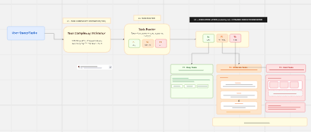
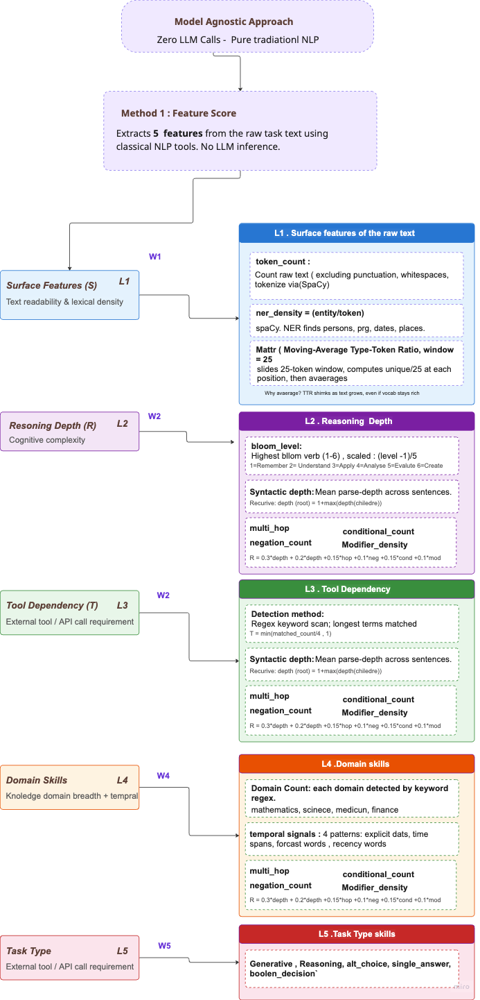

## Intelligent routing

## Model Agnostic Approach

## Baseline Experiment Protocol

Baseline experiment artifacts are under `experiments/baseline`:

- `experiments/baseline/PROTOCOL.md` — step-by-step research process
- `experiments/baseline/PROMPT_CONTRACT.md` — output/prompt invariants
- `experiments/baseline/run_manifest.template.yaml` — frozen run configuration template
- `experiments/baseline/results_tracker.csv` — stage-wise tracker for pilot/selection/full

#### Workting 3 parts

1. Query Complexity Estimator — QCE : Predicts which agent strategy a question needs before any llm runs
2. Query Router: Use the score to assign the minimum budget and acuurate agent strategy,
3. Execution Work flow:

How Query Complexity measured : Usin Graph representation: ( Using the DAG strucutre) . A neural network trains and give the score of of the query complexity.

### Agent Strategy: A = (a1, a2, a3,.. an)

Agents :

1. Raw LLM
2. CoT
3. self consistency : (multi path --> majory vote --> Temperature always >0)
4. ReAct --> (Thought --> Act --> observe)
5. Planner+verifier --> ( First plan, assign to workers, verifier)
6. Ensemble

#### Full pipeline

1. Download the Datasets -->
   1. MMLUPro, HotPOtQA, MISQUE, MATH LEVEL4 AND 5
   2. Split the Train, val, Test data
2. Run all the dataset through the Agents (a1,a2,a3,...) --> train dataset
   1. m agents\* n model
3. Golden dataset for the training : same train dataset
   1. Groundtruth label correctness : which is already in the dataset
      1. input : query, output: lableed answers
   2. Ground truth for the complexity/routing in continous score(0-1) usin the train split
      1. input : query,output : labeled rouring agent, cost, latency
4. Builld Query Complexity :
   1. using the graph representaion : train split
   2. input : query , output: graphs
5. Train Graph neural network
   1. Input: Labeled graphs, output: Trained QCE model
6. Train Qeury Router
   1. Input : Validation graphs with execution records, output : Tuned utility weights
7. Excution worflow : input rule based , putput : output monitor
8. Evaluate the benchamarks : (
   1. Input: test datasets) output: results tabke for Math, Musique, mmlu_pro, hotpotQA
9. Evaluate GAIA
10. GAIA validation set
11. Results
