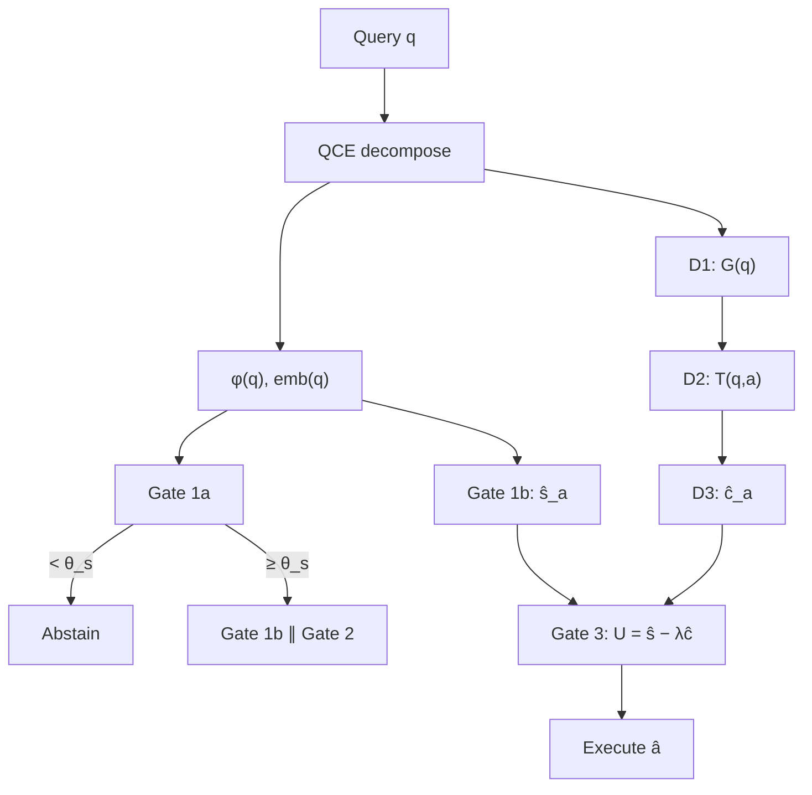

# D-AAR: Decomposed Adaptive Agent Routing

**Status:** Frozen (Version A only, 2026-06).

**Production (thesis methodology):** one function, one diagram, one CLI.

| What | Where |
| ---- | ----- |
| **Function** | `daar.infer.route_query()` |
| **CLI** | `scripts/infer_daar.py` |
| **Batch eval** | `scripts/route_daar.py` (Universe A), `scripts/eval_daar_on_eval_samples.py` (Universe B) |

---

## Primary contribution

> **The primary contribution is factorization, not state-of-the-art regret.**

D-AAR is a **decomposed routing framework** that exposes interpretable decision stages — not a claim to beat production monolithic routing overall.

| Setting                                | Finding                                              |
| -------------------------------------- | ---------------------------------------------------- |
| **Matched features** (Universe A)      | Decomposition helps — **0.089 vs 0.111**             |
| **Production embeddings** (Universe A) | Monolithic still wins — **0.022 vs 0.089**           |
| **Independent eval pool** (Universe B) | D-AAR generalizes competitively — **0.117 vs 0.135** |

**Do not frame as:** “We built a better router.”  
**Frame as:** “We built an interpretable decomposed routing framework, and showed when decomposition helps and where its limits are.”

---

## Why D-AAR matters (defense table)

Use when asked: _“If production wins, why should anyone care about D-AAR?”_

| Property               | Production | D-AAR     |
| ---------------------- | ---------- | --------- |
| Solvability explicit   | ✗          | ✓         |
| Cost explicit          | ✗          | ✓         |
| Utility explicit (λ)   | ✗          | ✓         |
| Human-auditable stages | Low        | High      |
| Matched-feature regret | 0.111      | **0.089** |
| Overall best regret    | **0.022**  | 0.089     |

**Conclusion:** D-AAR trades some raw predictive power for **interpretability** and **explicit control over deployment objectives** (abstention, λ, cost–accuracy Pareto). It exposes routing as separate, auditable stages and demonstrates that decomposition itself improves performance under controlled feature settings.

---

## Frozen experiments (cite only these)

| Category               | What to freeze                                              |
| ---------------------- | ----------------------------------------------------------- |
| **Method**             | Version A only                                              |
| **Primary validation** | Universe A: **0.089 vs 0.111** (matched cvec5, n=225)       |
| **Generalization**     | Universe B: **0.117 vs 0.135** (eval_samples, n=965)        |
| **Utility analysis**   | λ Pareto — λ=0 regret optimum; λ≥0.05 Gate 2 changes routes |
| **Appendix**           | GAIA worked example                                         |
| **Extension**          | D-AAR 2.0 → 0.116 (negative result)                         |

**Archive (brief mention only):** P0, P1, exploratory Gate 1b variants, early decomposed variants, θ sweeps, obsolete Gate 2 experiments → `archive/daar_thesis_freeze/`.

D-AAR 2.0 (`daar/v2/`) is **extension only** — not the headline method.

---

## 1. Research question

Can agent routing be decomposed into interpretable sub-problems — _solvability_, _agent success_, _structure-conditioned cost_, _utility_ — rather than a single holistic prediction?

**Agents:** `raw`, `cot`, `react`, `multiagent`  
**Primary metric:** mean agent regret — `regret(q) = r_best(q) − r_â(q)`.

**Regret nuance:** pooled regret (0.089 on Universe A) includes 89 unsolvable val queries that always contribute 0; solvable-only regret on 136 queries is ≈ **0.147**.

---

## 2. Production D-AAR (Version A)

**Figure 1 — methodology (use in thesis main text):**

```text
Query
 ↓
QCE
 ↓
Gate 1a (solvability)
 ↓
abstain?
 ↓ no
Gate 1b (success) ∥ Gate 2 (structure→cost)
 ↓
Gate 3 (utility)
 ↓
Execute selected agent
```

**Canonical function** (thesis pseudocode):

```python
def route_query(query):
    # QCE / D1
    G, phi, emb = qce(query)

    # Pool solvability (abstention)
    solvability_probability = pool_solvability.predict(phi, emb)
    if solvability_probability < abstention_threshold:
        return Abstain()

    # Gate 1b ∥ Gate 2 (parallel after abstention check)
    s_hat = gate1b.predict(phi)
    c_hat = simulate_cost(build_trace_skeleton(G))  # D2 → D3

    # Gate 3
    agent = argmax(s_hat - lambda_ * normalize(c_hat))
    return agent
```

Implementation: `daar/infer.py` → `route_query()`. CLI: `scripts/infer_daar.py`.

| Question                      | Stage   | Implementation                  |
| ----------------------------- | ------- | ------------------------------- |
| Can it be solved?             | Pool solvability | `P(solvable \| cvec5_emb)` |
| Who should solve it?          | Gate 1b | success-only soft-KL on `cvec5` |
| What would solving look like? | D1      | QCE → G(q)                      |
| How would agent a execute?    | D2      | G(q) → T(q,a)                   |
| What would that cost?         | D3      | T(q,a) → ĉ(q,a)                 |
| Is it worth it?               | Gate 3  | U = ŝ − λ·ĉ_norm                |

**Frozen Gate 1a (detection):** θ_s = **0.35** (max recall_unsolvable @ 5% false abstain on val).  
**Frozen routing:** λ = **0** (min regret on val). Legacy regret-based θ=0.05 → `archive/daar_thesis_freeze/`.

**Gate 2 wording (use consistently):** Gate 2 cost simulation is **architecturally integrated** and accurate (ρ≈0.9), but the **regret-optimal operating point selects rank-only routing** — i.e. **the cost term is unused at λ=0**. At λ ≥ 0.05, the cost term enters routing. Do **not** say “Gate 2 is empirically inactive.”



### Offline build (Figure 2 — appendix only)

How D-AAR was **built**, not how it **operates**. Do not show individual parquet scripts in methodology.

```text
Oracle
 ↓
QCE
 ↓
Train Gate 1a
Train Gate 1b
Build Gate 2
 ↓
Tune θ, λ
 ↓
Freeze
```

Script roles: `train_*.py`, `build_*.py` → offline build; `eval_*.py`, `run_thesis_*.py` → paper experiments; `infer_daar.py` → production.

---

## 3. Results (frozen)

Present **both** universes as co-equal evidence — Universe B is a strong generalization result, not a footnote.

### Primary validation — Universe A (daar val, n=225)

**Claim:** decomposition helps under **matched features**.

| Method                    | Features          | Regret    | Success |
| ------------------------- | ----------------- | --------- | ------- |
| **D-AAR Version A**       | cvec5 + cvec5_emb | **0.089** | 51.6%   |
| Fair monolithic cost_soft | cvec5             | 0.111     | 49.3%   |
| Production monolithic     | cvec5_emb         | **0.022** | 58.2%   |

Matched features: **0.089 vs 0.111** — decomposition wins.  
Production embeddings: **0.022 vs 0.089** — monolithic wins.

### Generalization — Universe B (eval_samples, n=965)

**Claim:** decomposition generalizes beyond the development pool — **strongest independent result**.

| Method               | Regret    | Success |
| -------------------- | --------- | ------- |
| **D-AAR decomposed** | **0.117** | 49.8%   |
| Production baseline  | 0.135     | 48.1%   |

Per dataset: hotpot 0.075, math 0.105, musique 0.180, gaia 0.127.

> Despite not outperforming the embedding-rich production router on the primary validation split, D-AAR generalized competitively to an independent evaluation pool and **outperformed the production baseline there** (0.117 vs 0.135).

### λ Pareto — deployment

| λ        | Regret              | Route changes vs λ=0 |
| -------- | ------------------- | -------------------- |
| **0.00** | **0.089** (optimum) | —                    |
| 0.01     | 0.089               | 0.9%                 |
| **0.05** | 0.120               | **8.4%**             |
| 0.50     | 0.271               | 73%                  |

Gate 2 cost simulation is architecturally integrated and accurate (ρ≈0.9), but the regret-optimal operating point selects rank-only routing; the cost term becomes active at λ ≥ 0.05.

### Extension — D-AAR 2.0 (negative)

| Metric | Version A | D-AAR 2.0 |
| ------ | --------- | --------- |
| Regret | **0.089** | 0.116     |

### Per-gate difficulty

| Gate        | Difficulty                              |
| ----------- | --------------------------------------- |
| Gate 1a     | Ceiling (val ROC-AUC 0.68; ~15% unsolvable recall @ 5% FA; θ=0.35) |
| **Gate 1b** | **Hard** — main error source            |
| Gate 2      | Easy — ρ ≈ 0.88–0.95 vs oracle          |

---

## 4. Conclusions (empirical wording)

### What the experiments support

1. **Factorization is the contribution** — solvability, ranking, structure-cost, and utility as distinct auditable stages.
2. **Matched features (Universe A):** decomposition improves regret — 0.089 vs 0.111.
3. **Generalization (Universe B):** D-AAR outperforms production on an independent pool — 0.117 vs 0.135.
4. **Gate 1b (within explored space):** Among the investigated Gate 1b formulations, success-only soft-KL ranking on solvable queries yielded the lowest regret (vs P0 0.151, P1 0.093, early decomposed 0.129, model variants tied at 0.089). Not universally optimal.
5. **Gate 2:** architecturally integrated, accurate (ρ≈0.9); cost term unused at λ=0; active at λ≥0.05.
6. **D-AAR 2.0** did not help (0.116) — reported transparently.

### What we did not beat

- Production monolithic (0.022) on primary val — **embeddings dominate** overall SOTA.
- Gate 1b ranking remains the bottleneck.

### Do not claim

- “We built a better router.”
- “Success-only Gate 1b is universally optimal.”
- “Gate 2 is empirically inactive” — say **“cost term unused at λ=0.”**
- Headline P0, P1, or archived ablations.

### Closing paragraph (thesis)

> Adaptive agent routing can be framed as a sequence of interpretable decisions rather than a single holistic prediction. D-AAR demonstrates that solvability assessment, agent ranking, structure-conditioned cost estimation, and utility-based selection can be operationalized as distinct stages within a unified routing framework. Although monolithic embedding-rich routers remain superior on the primary validation benchmark, the decomposed approach improves performance under matched feature settings and generalizes competitively to held-out evaluation pools. The results suggest that future progress in agent routing may depend less on increasingly complex utility formulations and more on improving the quality of success prediction and semantic representations within decomposed decision pipelines.

### Reviewer summary (defense)

> The work presents a carefully engineered decomposition of adaptive agent routing into solvability assessment, agent ranking, structure-derived cost estimation, and utility-based selection. While the resulting system does not surpass the strongest embedding-rich monolithic baseline, it demonstrates that decomposition itself improves routing under controlled feature settings and yields a more interpretable decision process. The negative results and extension studies are reported transparently, strengthening the credibility of the conclusions.

---

## 5. Entry points (engineering reference)

**Thesis answer to “What is D-AAR in production?”** → `route_query()` in `daar/infer.py`, invoked via `scripts/infer_daar.py`.

| Role | Entry point | Core module |
| ---- | ----------- | ----------- |
| **Production (one query)** | `scripts/infer_daar.py` | `daar/infer.py` → `route_query()` |
| **Batch eval — Universe A** | `scripts/route_daar.py` | `daar/routing.py` → `route_daar()` |
| **Batch eval — Universe B** | `scripts/eval_daar_on_eval_samples.py` | `daar/routing.py` + `daar/eval_cost.py` |
| **Routing math (shared)** | — | `route_agent()` in `daar/routing.py` |

Call chain inside production:

```text
infer_daar.py → route_query() → qce/D1 → pool_solvability → abstain? → agent_rank ∥ cost_model → route_agent()
```

**Offline build** (appendix / reproducibility — not methodology figures):

```text
export_daar_oracle.py → build_daar_splits.py → backfill_daar_qce_features.py
  → build_daar_embeddings.py → build_daar_train_frame.py
  → train_pool_solvability.py → verify_solvability_freeze.py → train_gate1b_success_soft.py
  → build_daar_trace_skeleton.py → simulate_daar_cost_hand.py
```

Thesis tables: `run_thesis_final_experiments.py`, `eval_per_dataset_regret.py`, `eval_utility_lambda_pareto.py`. Appendix: `build_gaia_worked_example.py`.

**Note:** batch eval precomputes Gate 1b ∥ Gate 2 for all queries; `route_query()` applies abstention first (correct online order). Both use the same `route_agent()` math.

**Not headline:** `route_daar2.py`, `infer_daar2_query.py`, `daar/v2/` (extension only).

---

## 6. Reproduce

```bash
uv run python scripts/route_daar.py --theta-joint-regret
uv run python scripts/run_thesis_final_experiments.py
uv run python scripts/eval_per_dataset_regret.py --split val
uv run python scripts/eval_daar_on_eval_samples.py
uv run python scripts/eval_utility_lambda_pareto.py
uv run python scripts/build_gaia_worked_example.py
uv run python scripts/infer_daar.py --training-id <uuid> --eval-tag gaia
```

| JSON artifact                    | Use                       |
| -------------------------------- | ------------------------- |
| `thesis_final_experiments.json`  | Universe A comparison     |
| `eval_samples_decomposed.json`   | Universe B generalization |
| `utility_lambda_pareto_val.json` | λ / Gate 2                |
| `gaia_example_trace.json`        | Appendix                  |
| `per_dataset_regret_val.json`    | Per-dataset breakdown     |

---

## 7. Limitations & future work

**Limitations:** QCE latency; Gate 1b not trajectory-aware; Gate 2 rule-based; cost term unused at λ=0 headline; embeddings gap vs production; precomputed QCE in eval.

**Future work:** better Gate 1b / embeddings within decomposed pipeline; λ>0 deployment; distilled Ĝ(q); trajectory-aware ŝ; residual Gate 2.

---

## 8. Data layout

```text
datasets/daar/   oracle, splits, features, frames, cache, traces, simulations, routing/
models/daar/     pool_solvability_model.joblib + pool_solvability_manifest.json (freeze v1_final)
datasets/daar/routing/  pool_solvability_freeze.json, solvability_frozen_eval_*.json
daar/            pool_solvability, query_frames, trace_skeleton, cost_hand, routing, infer
```

Train/val/test: 1,050 / 225 / 225. Val: Hotpot, MuSiQue, Math (no GAIA in daar val).
