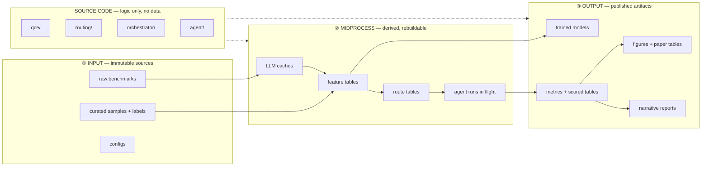
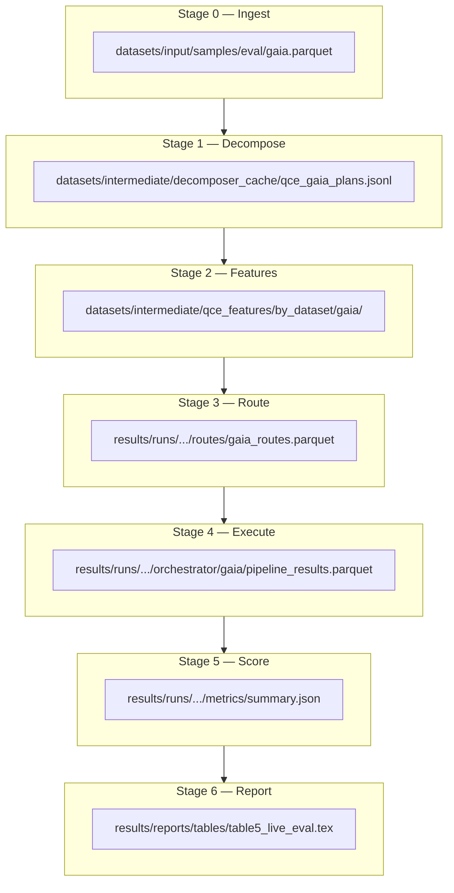

# Project Structure — Input · Midprocess · Output

Canonical layout for the QCE + agent-router research codebase.  
**Policy:** never delete superseded files — move to `archive/` with a manifest.

---

## 1. Mental model



| Zone | Rule | Git |
|------|------|-----|
| **Input** | Versioned, read-only during experiments | Sample parquets + docs tracked; full raw optional |
| **Midprocess** | Rebuild from input + code; safe to wipe | Mostly gitignored |
| **Output** | Immutable run snapshots; promote best to `reports/` | Gitignored except frozen `final_results/` |
| **Source code** | No hardcoded paths; paths from `config/` | Fully tracked |
| **Archive** | Superseded code/docs only | Fully tracked |

---

## 1b. Two evaluation universes (do not merge)

The codebase evaluates routing in **two separate worlds** with **different baseline systems**.
Refactors must keep these isolated end-to-end (data paths, scoring, CLI flags).

### Universe A — Internal QCE (`train` / `val` / `test`)

| | |
|---|---|
| **Queries** | 808-row pool: `datasets/train_samples/v1/qce_{train,val,internal_test}.csv` |
| **Features** | `datasets/qce_features/complexity_record_{split}.parquet`, `query_embeddings_{split}.parquet` |
| **Supervision** | `oracle_agent`, `p_*` from `oracle_results1.csv` |
| **Always-agent baseline** | **Virtual** — pivoted from oracle CSV (`analysis.oracle_outcome_matrix`); no separate agent runs |
| **Scoring** | `score_routed(..., split="test")` → `outcome_source: "oracle"` |
| **CLI** | `routing analyze --split test`, `routing soft-train`, `routing baselines` |

### Universe B — Live eval (`eval_samples`)

| | |
|---|---|
| **Queries** | `datasets/eval_samples/{gaia,hotpot,musique,math,mmlu}.parquet` |
| **Features** | Per-dataset tag under `datasets/qce_features/{tag}/` or `--build-features` |
| **Supervision** | None (held-out eval); gold = `expected_answer` |
| **Always-agent baseline** | **Physical** — four orchestrator runs per dataset: `{name}_baseline_{raw,cot,react,multiagent}/` |
| **On-disk root** | `results/orchestrator/graph_main_tuned/` (`LIVE_EVAL_BASELINE_ROOT`) |
| **Scoring** | `score_routed(..., dataset="gaia")` → `outcome_source: "live_baselines"` |
| **Oracle bounds / Table 5** | `routing oracle_bounds` → `results/reports/live_eval/` |
| **CLI** | `routing benchmark route-dist`, `orchestrator --dataset gaia --grade` |

### Baseline naming (four meanings of “baseline”)

| Term | Universe | Meaning |
|------|----------|---------|
| **Oracle CSV outcomes** | A | `oracle_results1.csv` — all agents on internal pool |
| **Always-{agent} virtual** | A | Metrics from oracle matrix (`analysis.baseline_strategies`) |
| **Always-{agent} physical** | B | Full eval run fixed to one agent (`graph_main_tuned/.../baseline_{agent}/`) |
| **Classifier baselines (Step 2)** | A | logreg/LGBM vs HGBM (`routing/baselines.py`) — not live eval runs |
| **Pre-routed baseline routes** | B | Parquet assigning every row to one agent (`baseline_routes/`) — input to execute-only |

See full per-module I/O: [`docs/MODULE_CATALOG.md`](MODULE_CATALOG.md).

---

## 2. Repository tree (target)

```
research_work/
│
├── config/                          # All paths & constants (from routing/config.py)
│   ├── paths.py                     # REPO_ROOT, dir roots
│   ├── router.py                    # model roles, feature sets, agents
│   ├── datasets.py                  # dataset aliases, display names
│   └── experiments.py               # experiment id registry
│
├── src/                             # Shared libraries (no CLI)
│   ├── data/                        # Download + load benchmarks
│   │   ├── registry.py
│   │   └── {gaia,hotpot,...}_loader.py
│   └── utils/                       # Labels, sampling, helpers
│       ├── soft_labels.py
│       └── stratified_sample.py
│
├── qce/                             # Phase 1: query → feature row
│   ├── decompose.py                 # LLM plan
│   ├── graph.py                     # procedure DAG
│   ├── complexity.py                # C(Q) vector (dim_*)
│   └── features/                    # (future) embed + heur builders
│
├── routing/                         # Phase 2–3: train + infer router
│   ├── cli.py                       # Single CLI entry (all subcommands)
│   ├── data/                        # Split loaders, parquet I/O
│   ├── features/                    # Eval feature build + column resolution
│   ├── train/                       # hard.py, soft_kl.py
│   ├── infer/                       # predict.py, selective.py
│   ├── eval/                        # outcomes.py, metrics.py, score.py
│   ├── runtime.py                   # RuntimeRouter (or → agent/)
│   └── figures.py                   # Figure generators (write to output/)
│
├── orchestrator/                    # Live eval glue
│   ├── pipeline.py                  # Thin coordinator
│   ├── load.py                      # Input frame loaders
│   ├── route_stage.py
│   ├── execute_stage.py
│   └── persist.py
│
├── agent/                           # Agent strategies + tools
├── evaluator/                       # Grading
├── prompts/                         # Prompt templates
│
├── scripts/                         # Offline data pipelines (all tracked)
│   ├── download.py
│   ├── create_train_samples.py
│   ├── create_eval_samples.py
│   ├── build_query_embeddings.py
│   └── build_query_heuristics.py
│
├── configs/                         # YAML dataset manifests
│   └── datasets.yaml
│
├── docs/                            # Architecture & structure (this file)
│   ├── qce_router_architecture.md
│   ├── PROJECT_STRUCTURE.md
│   └── figures/
│
├── archive/                         # Superseded code (move, never delete)
│   ├── README.md
│   └── refactor_YYYY/
│       ├── MANIFEST.md
│       └── …
│
├── datasets/                        # ① INPUT + ② MIDPROCESS (data on disk)
├── models/                          # ③ OUTPUT — trained artifacts
├── results/                         # ③ OUTPUT — experiment runs
├── final_results/                   # ③ OUTPUT — frozen paper snapshots
└── experiments/                     # Experiment manifests (what to run)
```

---

## 3. Data layout — Input · Midprocess · Output

### 3.1 INPUT (`datasets/input/`)

Immutable or curated source material. **Do not overwrite during eval runs.**

```
datasets/
├── input/
│   ├── raw/                         # Full benchmark downloads (optional local)
│   │   ├── gaia/
│   │   ├── hotpot/
│   │   ├── musique/
│   │   ├── math/
│   │   └── mmlu_pro/
│   │
│   ├── processed/                   # Normalized benchmark tables
│   │   └── {dataset}/train|test|validation.parquet
│   │
│   ├── samples/                     # Curated research subsets
│   │   ├── train/                   # QCE train pool (808 rows)
│   │   │   ├── combined.parquet
│   │   │   └── by_dataset/{hotpot,math,musique}.parquet
│   │   └── eval/                    # Live-eval holdouts (~165–200 each)
│   │       ├── gaia.parquet
│   │       ├── hotpot.parquet
│   │       ├── musique.parquet
│   │       ├── math.parquet
│   │       └── mmlu_pro.parquet
│   │
│   └── labels/                      # Supervision (versioned)
│       └── v1/
│           ├── qce_train.csv        # split assignments + oracle_agent
│           ├── qce_val.csv
│           ├── qce_internal_test.csv
│           ├── train_labels.csv     # per-agent outcomes for label gen
│           └── oracle_results.csv   # utility argmax labels
│
└── attachments/                     # GAIA files, etc.
    └── gaia/2023/validation/
```

**Current → target mapping**

| Current path | Target path |
|--------------|-------------|
| `datasets/eval_samples/*.parquet` | `datasets/input/samples/eval/` |
| `datasets/train_samples/v1/*.csv` | `datasets/input/labels/v1/` |
| `datasets/train_samples/*.parquet` | `datasets/input/samples/train/` |
| `datasets/processed/` | `datasets/input/processed/` |
| `datasets/raw/` | `datasets/input/raw/` |

---

### 3.2 MIDPROCESS (`datasets/intermediate/`)

Derived tables and caches. **Rebuild anytime** from input + code + API calls.

```
datasets/intermediate/
├── decomposer_cache/                # LLM decomposition plans (JSONL)
│   └── qce_{dataset}_plans.jsonl
│
├── qce_features/                    # Per-split / per-tag feature parquets
│   ├── by_split/                    # Internal QCE splits
│   │   ├── complexity_record_{split}.parquet
│   │   ├── query_embeddings_{split}.parquet
│   │   └── query_heuristics_{split}.parquet
│   └── by_dataset/                  # Live eval tags (gaia, hotpot, …)
│       └── {tag}/
│           ├── complexity_record_{tag}.parquet
│           └── query_embeddings_{tag}.parquet
│
└── merged/                          # Optional: pre-merged feature rows
    └── features_{split|tag}.parquet
```

**Lifecycle**

| Stage | Producer | Consumer |
|-------|----------|----------|
| Decompose cache | `qce/decompose.py` | `qce/graph.py`, `qce/complexity.py` |
| Complexity parquet | `qce/complexity.py` | `routing/features/` |
| Embeddings parquet | `scripts/build_query_embeddings.py` | `routing/features/` |
| Heuristics parquet | `scripts/build_query_heuristics.py` | selective / ablations |
| Merged features | `routing/features/eval_builder.py` | train + infer |

**Current → target mapping**

| Current | Target |
|---------|--------|
| `datasets/decomposer_cache/` | `datasets/intermediate/decomposer_cache/` |
| `datasets/qce_features/` | `datasets/intermediate/qce_features/` |

---

### 3.3 OUTPUT — Artifacts (`models/`)

Trained, frozen objects used at inference. **Promote explicitly; never overwrite production without `--save`.**

```
models/
├── router/
│   ├── production/                  # Deploy defaults (primary + secondary)
│   │   ├── hgbm_cvec5_emb_soft_kl.joblib
│   │   ├── hgbm_cvec5_emb_soft_kl.json
│   │   ├── logreg_cvec5_emb_soft_kl.joblib
│   │   └── logreg_cvec5_emb_soft_kl.json
│   ├── selective/                   # Phase-2 gate models
│   │   ├── hgbm_emb_only_soft_kl.joblib
│   │   └── …
│   ├── legacy/                      # Hard-label baselines (paper comparison)
│   │   └── hgbm_cvec5_emb_default.joblib
│   └── experiments/                 # Ablation / tuning checkpoints
│       ├── cvec7/
│       ├── heur_emb/
│       └── tuned/
│
├── qce_graph/
│   └── train_norm.json              # C(Q) normalization stats
│
├── query_embeddings/
│   └── pca_16.joblib                # Embedding PCA fit on train
│
└── qce_heuristics/
    └── train_calibrator.json
```

**Naming convention for router artifacts**

```
{classifier}_{feature_set}_{supervision}.joblib
  classifier   = hgbm | logreg
  feature_set  = cvec5_emb | emb_only | heur_emb | …
  supervision  = soft_kl | default (hard)
```

Sidecar `.json` always accompanies `.joblib` (feature cols, train date, metrics).

**Current → target:** move `models/router/graph_main/*` → `models/router/production/` + `legacy/` + `experiments/` by role (archive old folder layout in `archive/`).

---

### 3.4 OUTPUT — Results (`results/`)

Experiment runs, scored tables, route files. **One run = one directory with manifest.**

```
results/
├── runs/                            # Atomic experiment runs
│   └── {YYYY-MM-DD}_{experiment_id}/
│       ├── manifest.json            # config snapshot, git hash, seeds
│       ├── routes/                  # Midprocess-adjacent but run-scoped
│       │   └── {dataset}_routes.parquet
│       ├── orchestrator/            # Agent execution outputs
│       │   └── {dataset}/{run_name}/
│       │       ├── pipeline_results.parquet
│       │       ├── pipeline_results.jsonl
│       │       └── pipeline_results.summary.json
│       ├── metrics/
│       │   ├── per_question.csv
│       │   ├── summary.json
│       │   └── oracle_bounds.csv
│       └── figures/
│           └── *.png
│
├── baselines/                       # Universe B: physical always-{agent} live eval runs
│   └── {dataset}/                   # (today: results/orchestrator/graph_main_tuned/)
│       └── {name}_baseline_{agent}/
│           └── pipeline_results.parquet
│
├── baseline_routes/                 # Universe B: pre-routed parquets (execute-only input)
│   └── {dataset}_baseline_{agent}_routes.parquet
│
├── analysis/                        # Universe A: internal QCE split analysis only
│   └── {experiment_id}/{split}/     # uses oracle_results1.csv, NOT live baselines
│       ├── per_question.csv
│       ├── complexity_regions.csv
│       └── confidence_sweep.csv
│
└── reports/                         # Paper-ready aggregates (human curated)
    ├── live_eval/
    │   ├── oracle_bounds_long.csv
    │   └── TABLE5_DISCUSSION.md
    ├── router_soft_hgbm/
    │   └── DISCUSSION_SLICES.md
    └── tables/
        └── table5_live_eval.tex
```

**Run manifest schema (`manifest.json`)**

```json
{
  "experiment_id": "soft_hgbm_benchmark",
  "created_at": "2026-05-30T12:00:00Z",
  "git_commit": "abc123",
  "router_path": "models/router/production/hgbm_cvec5_emb_soft_kl.joblib",
  "datasets": ["gaia", "hotpot"],
  "flags": {"build_features": true, "grade": true},
  "inputs": {
    "eval_samples": "datasets/input/samples/eval/gaia.parquet",
    "labels": null
  }
}
```

**Current → target mapping**

| Current | Target |
|---------|--------|
| `results/experiments/soft_hgbm_benchmark/` | `results/runs/2026-05-XX_soft_hgbm_benchmark/` |
| `results/orchestrator/graph_main_tuned/` | `results/baselines/` + `results/runs/.../orchestrator/` |
| `results/reports/` | stays `results/reports/` (paper layer) |
| `results/experiments/_archive/` | `archive/results/...` or `results/_archive/` |

---

### 3.5 OUTPUT — Figures & paper (`results/reports/` + `final_results/`)

```
results/reports/                     # Working paper artifacts (iterative)
├── figures/
│   ├── fig4_regret_comparison.pdf
│   └── fig5_live_eval_em.pdf
├── tables/
│   └── table5_live_eval.tex
└── narrative/
    ├── TABLE5_DISCUSSION.md
    └── router_soft_hgbm/DISCUSSION_SLICES.md

final_results/                       # Frozen submission snapshot (tagged release)
└── v1_submission/
    ├── figures/
    ├── tables/
    └── metrics_summary.json
```

**Rule:** scripts write to `results/runs/.../figures/`; you **promote** to `results/reports/` when figure-ready; copy to `final_results/` at submission time.

---

## 4. Pipeline stages (midprocess in code)

Each stage has explicit **input schema → output schema**.



| Stage | Module | CLI | Primary output columns |
|-------|--------|-----|------------------------|
| 0 Ingest | `src/data/` | `scripts/download.py` | `query_id`, `query`, `expected_answer`, `dataset` |
| 1 Decompose | `qce/decompose.py` | `--build-features` | cache JSONL |
| 2 Features | `qce/complexity.py`, embed script | `--build-features` | `dim_*`, `emb_*`, `heur_*` |
| 3 Route | `routing/infer/predict.py` | `routing benchmark route-dist` | `prob_*`, `assigned_agent` |
| 4 Execute | `orchestrator/execute_stage.py` | `orchestrator --routes-path --grade` | `predicted_answer`, `cost_usd`, `latency_s` |
| 5 Score | `routing/eval/score.py` | `routing score-routes` | `is_correct`, `utility_regret` |
| 6 Report | `routing/figures.py`, manual | `routing figures` | `.tex`, `.pdf`, `.md` |

---

## 5. Column naming standard (data contracts)

### Identity

| Column | Type | Description |
|--------|------|-------------|
| `query_id` | str | Stable primary key (today: `training_id`) |
| `dataset` | str | `gaia`, `hotpot`, `musique`, `math`, `mmlu_pro` |

### Features

| Prefix | Example | Source |
|--------|---------|--------|
| `complexity_dim_` | `complexity_dim_structural` | QCE C(Q) (today: `dim_*`) |
| `embedding_dim_` | `embedding_dim_00` | PCA-16 (today: `emb_*`) |
| `heuristic_` | `heuristic_token_count` | query heuristics (today: `heur_*`) |

### Routing

| Column | Description |
|--------|-------------|
| `prob_{agent}` | Router softmax (today: `p_{agent}`) |
| `assigned_agent` | Argmax route (today: also `router_pred`) |
| `prob_max`, `prob_margin_top2` | Confidence (today: `max_prob`, `margin_top2`) |

### Execution

| Column | Description |
|--------|-------------|
| `expected_answer` | Gold (canonical; aliases migrated at load) |
| `predicted_answer` | Parsed model output |
| `agent_strategy` | Which agent ran |
| `cost_usd`, `latency_s` | Resource metrics |
| `is_correct` | Graded EM |

**Migration:** loaders accept old names, write new names; old names kept as aliases until `archive/` migration complete.

---

## 6. CLI map (single entry points)

```bash
# Data — Input
uv run python scripts/download.py --dataset gaia
uv run python scripts/create_eval_samples.py
uv run python scripts/create_train_samples.py

# Midprocess — Features
uv run python qce/decompose.py --tag gaia
uv run python scripts/build_query_embeddings.py --tag gaia
uv run python qce/complexity.py --tag gaia

# Midprocess — Train router (Output: models/)
uv run python -m routing train soft-kl --classifier hgbm --save

# Midprocess — Route (Output: results/runs/.../routes/)
uv run python -m routing benchmark route-dist --out results/runs/$(date +%F)_live_eval/routes

# Midprocess — Execute (Output: results/runs/.../orchestrator/)
uv run python orchestrator/pipeline.py \
  --routes-path results/runs/.../routes/gaia_routes.parquet \
  --grade

# Output — Score + Analyze
uv run python -m routing score-routes --routes-path ... --dataset gaia
uv run python -m routing analyze --split test
uv run python -m routing figures
```

---

## 7. Archive policy

```
archive/
├── README.md
├── refactor_2026/
│   ├── MANIFEST.md                  # old_path → new_path, date, reason
│   ├── routing/router_monolith.py
│   └── datasets_paths_legacy.py
├── deprecated/
│   └── routellm/
└── results/
    └── experiments_legacy/          # optional: old results tree snapshots
```

**Rules**

1. Move, never delete.
2. Every batch has `MANIFEST.md`.
3. Active code may re-export from new location with `DeprecationWarning`.
4. `archive/` is **git-tracked** (unlike `old/` which is local-only legacy).

---

## 8. Migration order (structure only)

| Step | Action | Risk |
|------|--------|------|
| 1 | Create `config/paths.py`; symlink old constants | Low |
| 2 | Add `archive/README.md` + manifest template | None |
| 3 | Reorganize `datasets/` → `input/` + `intermediate/` with path aliases in config | Medium — update all path constants |
| 4 | Reorganize `models/router/` by role | Low — config drives paths |
| 5 | Standardize `results/runs/{date}_{id}/` for new experiments | Low — old results stay in place |
| 6 | Column rename via loaders (not bulk parquet rewrite) | Medium |
| 7 | Split code modules; archive monoliths | High — do last |

---

## 9. What stays where (no move)

| Path | Reason |
|------|--------|
| `qce/`, `agent/`, `evaluator/`, `prompts/` | Already focused |
| `old/` | Pre-existing local legacy; do not merge with `archive/` |
| `datasets/decomposer_cache/` | Until step 3 migration |
| Running orchestrator jobs | Finish before path migration |

---

## 10. Quick reference card

```
INPUT       datasets/input/{samples,labels,processed,raw}
MIDPROCESS  datasets/intermediate/{decomposer_cache,qce_features}
ARTIFACTS   models/{router,qce_graph,query_embeddings}/...
RESULTS     results/runs/{date}_{experiment_id}/...
REPORTS     results/reports/{figures,tables,narrative}
FROZEN      final_results/{version}/
CODE        qce/ routing/ orchestrator/ agent/ src/
ARCHIVE     archive/{refactor_*,deprecated}/
CONFIG      config/ configs/
```
