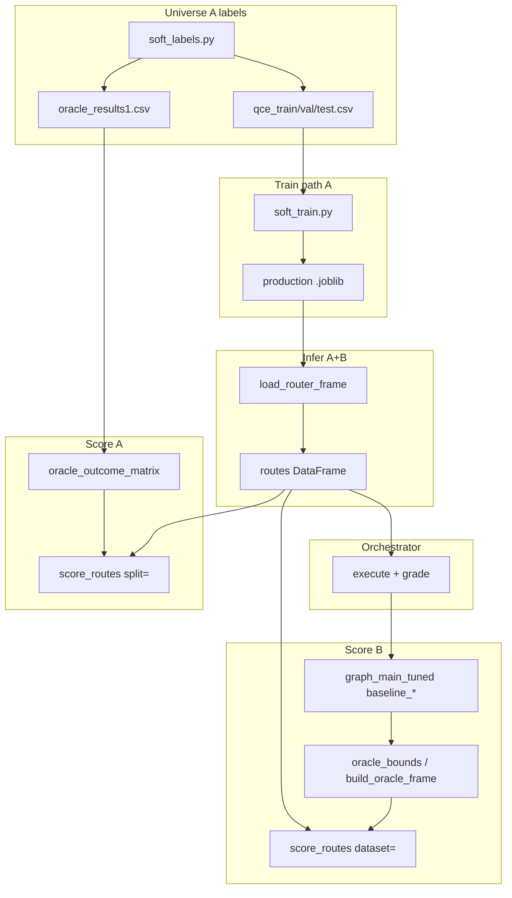

# Refactoring Playbook — Attentive, Zero-Behavior-Change

**Purpose:** Single checklist used **before, during, and after** every refactor step.  
If any gate fails → stop, rollback from `archive/`, fix — do not stack changes.

**Companion docs**
- [`MODULE_CATALOG.md`](MODULE_CATALOG.md) — per-file IN / MID / OUT + universe A/B
- [`PROJECT_STRUCTURE.md`](PROJECT_STRUCTURE.md) — target disk + code layout
- [`REFACTOR_PLAN.md`](REFACTOR_PLAN.md) — phases 0–6 timeline

---

## 1. Operating principles (non-negotiable)

| # | Principle | Meaning |
|---|-----------|---------|
| P1 | **Behavior frozen** | Same inputs → same outputs (predictions, metrics, file shapes, CLI exit codes) |
| P2 | **Links preserved** | Import graph and call chains stay valid; shims until callers migrate |
| P3 | **Move, never delete** | Superseded code → `archive/refactor_2026/` + `MANIFEST.md` |
| P4 | **One concern per step** | One extraction OR one split OR one path alias — never two at once |
| P5 | **Universe A ≠ B** | Internal QCE (oracle CSV) and live eval (physical baselines) never share scoring paths |
| P6 | **Minimal diff** | Smallest change that improves structure; no drive-by renames or style sweeps |
| P7 | **Scalar modules** | Target ≤400 lines per file; one clear IN → MID → OUT boundary |
| P8 | **Power via composition** | Small functions + explicit dataclasses (`RouteResult`, …), not new frameworks |

**Efficiency goal:** less duplication, clearer boundaries — **not** faster algorithms or different ML.

---

## 2. Invariants registry (must hold after every step)

### 2.1 Inference

- [ ] `hgbm_cvec5_emb_soft_kl.joblib` on golden 100 rows: max |Δp| < 1e-6
- [ ] `assigned_agent` / `router_pred` identical for same feature rows
- [ ] `PROBA_COLS` sum to 1.0 per row

### 2.2 Universe A (internal)

- [ ] `routing analyze --split test` metrics match baseline CSV (regret ≈ 0.192 primary)
- [ ] `oracle_outcome_matrix(oracle_results1.csv)` row count unchanged for test ids
- [ ] `soft-train` eval harness regret unchanged
- [ ] `baseline_strategies()` always_{agent} EM unchanged

### 2.3 Universe B (live eval)

- [ ] `score_routes --dataset gaia` matches prior summary when baselines exist
- [ ] `oracle_bounds` CSV hash matches `results/reports/live_eval/oracle_bounds_long.csv`
- [ ] Table 5 source numbers unchanged
- [ ] `benchmark route-dist` writes same route distribution counts

### 2.4 Orchestrator

- [ ] `--routes-path` + `--grade` + resume: pending rows only, merge order preserved
- [ ] `--split test --route-only` + `score_lookup`: uses oracle, not live baselines
- [ ] `--dataset gaia --route-only` + `score_lookup`: uses live baselines
- [ ] Checkpoint parquet / JSONL schema columns unchanged

### 2.5 Public API

- [ ] Every symbol in `routing.__all__` imports
- [ ] `from routing import RuntimeRouter, load_router_frame, …` unchanged
- [ ] `python -m routing`, `orchestrator/pipeline.py` CLI flags unchanged

---

## 3. Scenario matrix (think before every change)

Use this when touching a module. **Which scenarios apply?**

| Scenario | Trigger | Must verify |
|----------|---------|-------------|
| **S1** | Changed `router.py` / infer | Golden inference; both universes route |
| **S2** | Changed outcome loading | A: oracle CSV path; B: `graph_main_tuned` paths |
| **S3** | Changed `load_split` / features | A: train/val/test parquets merge; B: eval tag + `--build-features` |
| **S4** | Changed orchestrator routing branch | 4 inputs: routes-path, split, dataset, selective |
| **S5** | Changed orchestrator execute loop | react_only, cascade, grade, resume, append-to |
| **S6** | Changed config paths | Docker mount; existing disk files still found (legacy alias) |
| **S7** | Changed selective | Internal τ sweep + orchestrator `--selective-qce` on GAIA |
| **S8** | Changed soft_train / baselines | Step 2 CSV; 4-way regret figure inputs |
| **S9** | Changed score_routes dispatch | `split=` vs `dataset=` never crossed |
| **S10** | Changed imports / package layout | `routing.__init__`, benchmark subprocess, Docker CMD |

**Rule:** list applicable scenarios in commit message / MANIFEST entry for each step.

---

## 4. Dependency links (do not break)



**Extract order (respects dependencies):**
1. `config/paths` (no consumers break)
2. `eval/outcomes.py` (leaf: analysis + oracle_bounds + score_routes)
3. `eval/metrics.py` (uses outcomes)
4. `features/eval_builder.py` (router + selective)
5. Split `router.py` (many dependents — shims mandatory)
6. Split `orchestrator/pipeline.py` (last — highest integration)

---

## 5. Step discipline (how not to get stuck)

### Before coding

1. Read `MODULE_CATALOG.md` entry for target file(s)
2. List applicable scenarios (§3)
3. Record baseline: `pytest`, `routing verify` (once Phase 0 exists), or manual command output
4. If move: write `archive/.../MANIFEST.md` entry **first** (planned old → new paths)

### During coding

1. **Copy → wire → delete from original** (never delete; move to archive)
2. Keep old function as one-line delegate until gate passes
3. No rename of public columns / CLI flags in same step as extraction
4. If circular import appears → stop; move shared constant to `config/` only

### After coding

1. Run invariant checklist (§2) for applicable scenarios
2. If fail → revert step only (from archive), not whole phase
3. Update MANIFEST with actual commit hash + test commands run

### When stuck

| Symptom | Likely cause | Action |
|---------|--------------|--------|
| Import cycle | Split too aggressively | Extract constants to `config/`; lazy import |
| Metric drift | Wrong outcome source | Check `outcome_source` in summary; A vs B |
| Missing parquet | Path alias wrong | `RESEARCH_USE_NEW_PATHS=0`; fix alias only |
| Resume broken | Changed merge key | `training_id` must stay str; don't rename yet |
| Docker fail | Volume / PYTHONPATH | Phase 4 only; keep `sys.path` shim until then |

---

## 6. Execution order (locked)

```
Phase 0  Safety net (tests, verify, Docker fix, golden fixtures A+B)
    ↓ GATE: §2.1–2.5 partial (imports + inference)
Phase 1  config/paths + settings (legacy aliases, break cycles)
    ↓ GATE: full §2 + both universes smoke
Phase 2  outcomes.py → metrics.py → eval_builder.py (dedupe only)
    ↓ GATE: §2.2 + §2.3 scoring unchanged
Phase 3  Split router.py → archive monolith; split orchestrator
    ↓ GATE: §2.4 + benchmark subprocess + S10
Phase 4  Package install + unified CLI + Docker HEALTHCHECK
    ↓ GATE: clean clone + docker verify
Phase 5  Data layout flag (opt-in paths)
    ↓ GATE: flag=0 and flag=1 both pass §2
Phase 6  Logging, manifests, CI (ops polish)
```

**Do not skip gates.** Do not start Phase 3 before Phase 2 dedupe (reduces split surface).

---

## 7. Module header template (add when touching a file)

```python
"""
Universe: A | B | both
IN:  <paths / DataFrame columns / API args>
MID: <single responsibility>
OUT: <artifacts / return type>
Deps: <direct project imports only>
See: docs/MODULE_CATALOG.md §<section>
"""
```

Add/refresh header **in the same PR as the structural change** to that file — not a blanket comment sweep.

---

## 8. Definition of done (whole refactor)

- [ ] No file > ~500 lines in `routing/`, `orchestrator/`
- [ ] `outcomes.from_oracle_csv` and `outcomes.from_live_baselines` are the only outcome builders
- [ ] `config/paths.py` is sole source of directory roots (legacy aliases documented)
- [ ] `archive/refactor_2026/MANIFEST.md` complete
- [ ] §2 invariants all green
- [ ] README: deploy from Docker + `research-route verify`
- [ ] Table 5 + oracle bounds reproducible from docs commands

---

## 9. What we are NOT doing

- Changing HGBM params, soft-KL math, or utility λ=25
- Merging universe A and B data paths without explicit flag
- Renaming `training_id` / `p_*` in stored parquets (loaders only, later)
- Deleting `old/` tree
- Adding features, agents, or new benchmarks during refactor

---

## 10. Next action (when you say go)

**Phase 0 only** — no logic moves:

1. `tests/golden/` — fixtures for universe A (test split rows) + B (gaia routes sample)
2. `tests/test_inference_golden.py`
3. `tests/test_imports_public_api.py`
4. `routing verify` subcommand (load model, one predict, path checks)
5. `archive/README.md` + manifest template
6. Docker compose `results_v2` → `results`

Estimated: 1 focused session. Zero production behavior change.

**Wait for explicit approval before Phase 0 code.**
