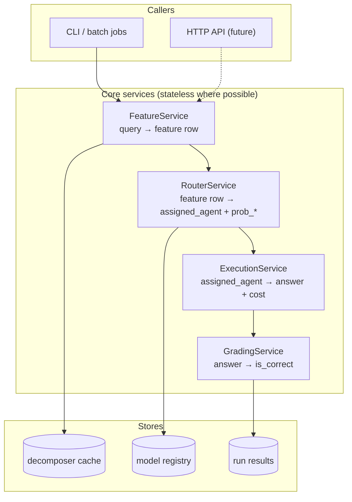

# Refactor Strategy — Production-Ready, Zero-Behavior-Change

**Goal:** Restructure for clarity, reviewability, and deployment **without changing**
router predictions, metrics, grading, or reproducibility of published results (Table 5,
oracle bounds, internal-test regret).

**Policies**

- Move superseded files to `archive/` — never delete.
- Every phase ends with a **verification gate** before the next phase starts.
- Old import paths and CLI commands keep working via shims until explicitly deprecated.
- Data on disk migrates via **config aliases**, not bulk parquet rewrites, until Phase 5.

**Companion docs:** `docs/PROJECT_STRUCTURE.md`, `docs/MODULE_CATALOG.md`, `docs/qce_router_architecture.md`

**Critical:** Internal QCE (universe A) and live eval (universe B) use **different baseline
systems** — oracle CSV vs physical always-agent runs. Never merge scoring paths. See
`MODULE_CATALOG.md` §1.

---

## 1. Production target (end state)

What “productionized” means for this project:



| Production requirement          | Today                               | After refactor                              |
| ------------------------------- | ----------------------------------- | ------------------------------------------- |
| **Single deploy command**       | Docker exists; volume paths wrong   | Fixed compose + env-based config            |
| **Pinned model version**        | Multiple path aliases               | `models/router/production/` + manifest      |
| **Separate route / execute**    | Collapsed in `run_pipeline`         | Two stages, composable                      |
| **Reproducible runs**           | Ad-hoc output dirs                  | `results/runs/{date}_{id}/manifest.json`    |
| **Installable package**         | `package = false`, `sys.path` hacks | `pip install -e .` with entry points        |
| **Health / smoke test**         | None                                | `routing verify` + `orchestrator --limit 1` |
| **No legacy import at runtime** | `old/difficulty` via `sys.path`     | Inlined minimal heuristic cols              |
| **Observability**               | `print()`                           | Structured logs + run manifest              |

---

## 2. Non-negotiables (must not break)

### 2.1 Behavioral invariants

| Invariant                                         | Verification                      |
| ------------------------------------------------- | --------------------------------- |
| Same `.joblib` → same `p_*` on fixed feature rows | Golden inference test (100 rows)  |
| Internal test regret ≈ 0.192 (primary HGBM)       | `soft-train` eval metrics CSV     |
| Live eval oracle bounds unchanged                 | Diff `oracle_bounds_long.csv`     |
| Table 5 numbers unchanged                         | Diff scored route summaries       |
| Resume / checkpoint semantics                     | Re-run GAIA with `--append-to`    |
| Selective QCE τ sweep rankings                    | Diff `recommended_tau.json`       |
| Agent execution + grading                         | `--limit 3 --grade` smoke on GAIA |

### 2.2 Dependency map (preserve during moves)

```
orchestrator/pipeline.py
  → routing.config (paths, selective defaults)
  → routing.router (RuntimeRouter, load_router_frame, ensure_eval_features, load_split)
  → routing.selective (SelectiveGateConfig, route_selective_*)
  → routing.score_routes (score_routed)
  → agent.registry, agent.dataset_profile, evaluator.grade

routing/__init__.py  (public API — do not break exports)
  → 20+ symbols from routing.router + routing.config + routing.analysis

routing/benchmark.py
  → subprocess orchestrator/pipeline.py
  → routing.router, routing.score_routes

routing/soft_train.py
  → routing.baselines, routing.router, routing.analysis

routing/selective.py
  → qce.decompose, qce.complexity, scripts.build_query_embeddings
  → routing.router (feature build overlap)

src/utils/soft_labels.py
  → routing.router.plans_from_cache (lazy)
```

**Rule:** Any split of `router.py` must keep `routing/__init__.py` exports identical
until Phase 4 removes shims.

### 2.3 Published artifacts (freeze before refactor)

Before Phase 2 code moves, snapshot these as golden references:

```
results/reports/live_eval/oracle_bounds_long.csv
results/reports/table5_live_eval.tex          # source numbers
results/experiments/soft_kl_cvec5_emb/        # primary metrics
models/router/graph_main/hgbm_cvec5_emb_soft_kl.joblib
datasets/train_samples/v1/qce_internal_test.csv
```

Store checksums in `tests/golden/manifest.json` (created in Phase 0).

---

## 3. Safety mechanisms

### 3.1 Golden tests (add in Phase 0)

```
tests/
├── golden/
│   ├── manifest.json              # SHA256 of reference files
│   ├── inference_sample.parquet   # 100 rows with known p_*
│   └── expected_predictions.json
├── test_inference_golden.py       # load joblib → predict → assert allclose
├── test_config_paths.py           # all PRIMARY paths exist on disk
├── test_imports_public_api.py     # routing.__all__ imports resolve
└── test_oracle_bounds_regression.py  # optional; compares CSV hash
```

Run before engine `uv run pytest tests/ -q` before and after every phase.

### 3.2 Shim pattern (every extraction)

```python
# routing/router.py (during migration)
import warnings
from routing.infer.predict import attach_router_predictions  # new home

def load_router_frame(...):
    return _load_router_frame(...)  # delegate

# re-export for back-compat
__all__ = [..., "load_router_frame", ...]
```

Shim file moves to `archive/` only after:

1. All internal imports updated
2. Golden tests pass
3. One full live-eval benchmark completes

### 3.3 Feature flags for path migration

```python
# config/paths.py
USE_NEW_DATA_LAYOUT = os.getenv("RESEARCH_USE_NEW_PATHS", "0") == "1"

def eval_samples_dir() -> Path:
    if USE_NEW_DATA_LAYOUT:
        return REPO_ROOT / "datasets/input/samples/eval"
    return REPO_ROOT / "datasets/eval_samples"  # legacy
```

Toggle in CI/staging before flipping production default.

---

## 4. Phase plan

### Overview

| Phase | Focus                       | Duration  | Risk   | Deploy value        |
| ----- | --------------------------- | --------- | ------ | ------------------- |
| **0** | Safety net + config fixes   | 3–5 days  | Low    | Baseline trust      |
| **1** | Config + paths (aliases)    | 3–5 days  | Low    | Env-based deploy    |
| **2** | Dedupe logic (no moves)     | 5–7 days  | Medium | Less drift          |
| **3** | Split god modules + archive | 7–10 days | High   | Reviewable code     |
| **4** | Package + Docker + CLI      | 5–7 days  | Medium | Installable product |
| **5** | Data layout + naming        | 5–7 days  | Medium | Enterprise data     |
| **6** | Production hardening        | 5–7 days  | Low    | Ops-ready           |

**Total:** ~6–8 weeks part-time, or ~3–4 weeks full-time.  
Phases 0–1 unblock deployment fixes; Phases 2–3 unblock team review; Phases 4–6 are production polish.

---

### Phase 0 — Safety net (DO FIRST)

**Objective:** Prove current behavior before touching structure.

**Tasks**

1. Create `archive/README.md` + `MANIFEST.md` template
2. Add `tests/golden/` with inference sample + checksum manifest
3. Add `tests/test_inference_golden.py` — same predictions ±1e-6
4. Add `tests/test_imports_public_api.py` — all `routing.__all__` import
5. Fix **config contradictions** (no path moves):
   - Document canonical: `ROUTER_MODEL_PATH` = primary soft-KL HGBM
   - Fix or rename `model_path_for_feature_set` if it returns legacy hard path
6. Fix Docker compose: `results_v2` → `results` volume mount
7. Track gitignored scripts: `build_query_embeddings.py`, `build_query_heuristics.py`
8. Add `routing verify` subcommand:
   - Primary model loads
   - Predict on 1 internal-test row
   - All config paths exist

**Verification gate**

```bash
uv run pytest tests/ -q
uv run python -m routing verify
uv run python -m routing analyze --split test  # metrics within ε of saved CSV
```

**Rollback:** N/A (no structural changes).

**Archive:** Nothing moved yet.

---

### Phase 1 — Centralized config (behavior-preserving)

**Objective:** One config module; deployment via environment variables.

**Tasks**

1. Create `config/` package:
   - `config/paths.py` — all directory roots + legacy aliases
   - `config/router.py` — move from `routing/config.py` (keep re-export shim)
   - `config/settings.py` — `Settings` from env vars:
     ```
     RESEARCH_ROUTER_MODEL_PATH
     RESEARCH_OUTPUT_ROOT
     RESEARCH_USE_NEW_PATHS
     OPENAI_API_KEY (existing .env)
     ```
2. Break circular imports:
   - Move `REPO_ROOT`, `DATASET_DISPLAY_NAMES` to `config/paths.py`
   - `analysis.py` imports from `config`, not `router`
3. Remove `sys.path.insert` for `old/` — inline minimal heuristic column list in
   `routing/features/columns.py`; archive full `old/difficulty/feature_measure.py` reference
4. Add `config/experiments.yaml` — registry of experiment ids (optional, human-readable)

**Verification gate**

```bash
uv run pytest tests/ -q
uv run python -m routing verify
# Diff analyze outputs — must match Phase 0 baseline
diff results/experiments/soft_kl_cvec5_emb/soft_kl_metrics_hgbm.csv \
     /tmp/baseline_soft_kl_metrics_hgbm.csv
```

**Rollback:** `routing/config.py` shim re-exports everything; delete `config/` if needed.

**Archive:** `archive/refactor_2026/config/routing_config_snapshot.py` (copy before edit).

---

### Phase 2 — Extract duplicated logic (pure functions, no file splits)

**Objective:** One implementation per behavior; callers updated; no god-module split yet.

**Extractions (order matters — dependencies flow down)**

| New module                         | Absorbs from                                                                                           | Callers updated                                  |
| ---------------------------------- | ------------------------------------------------------------------------------------------------------ | ------------------------------------------------ |
| `routing/eval/outcomes.py`         | `analysis.oracle_outcome_matrix`, `oracle_bounds.build_oracle_frame`, `score_routes._add_utility_cols` | analysis, oracle_bounds, score_routes, selective |
| `routing/features/eval_builder.py` | `router.build_eval_features`, `selective.build_eval_*`                                                 | router, selective, orchestrator (indirect)       |
| `routing/eval/metrics.py`          | `analysis.metrics_for_*`, selective regret blocks                                                      | analysis, selective, baselines                   |
| `routing/datasets.py`              | `benchmark.DATASET_DISPLAY`, `analysis.DATASET_DISPLAY_NAMES`                                          | benchmark, analysis, oracle_bounds               |

**Process per extraction**

1. Copy function bodies to new module (verbatim first)
2. Old location calls new module (thin wrapper)
3. Golden tests pass
4. Run full internal test analysis + one live eval score
5. Copy old duplicated blocks → `archive/refactor_2026/routing/_extracted_*.py` with comment

**Verification gate**

```bash
uv run pytest tests/ -q
uv run python -m routing analyze --split test
uv run python -m routing score-routes \
  --routes-path results/experiments/soft_hgbm_benchmark/routes/gaia_routes.parquet \
  --dataset gaia
# Compare summary JSON to Phase 0 baseline
```

**Rollback:** Wrappers still in old locations; delete new modules.

---

### Phase 3 — Split god modules + archive monoliths

**Objective:** Files ≤400 lines; clear stage boundaries; archive originals.

#### 3a. Split `routing/router.py`

| New file                       | Contents                                                                |
| ------------------------------ | ----------------------------------------------------------------------- |
| `routing/data/splits.py`       | `load_split`, `load_eval_parquet`, `eval_base_frame`, merge helpers     |
| `routing/features/columns.py`  | `router_feature_cols`, embedding/heuristic col detection                |
| `routing/train/pipeline.py`    | `pipeline`, `fit_router`, `train_router`, `TrainSpec`                   |
| `routing/train/experiments.py` | ablations, seed sweep, LODO, `_cli_tune`                                |
| `routing/infer/predict.py`     | `attach_router_predictions`, `load_router_frame`, `predict_agent_proba` |
| `routing/runtime.py`           | `RuntimeRouter`, `run_agent_cascade`                                    |
| `routing/router.py`            | **Shim only** — re-exports all public names                             |

#### 3b. Split `orchestrator/pipeline.py`

| New file                        | Contents                                     |
| ------------------------------- | -------------------------------------------- |
| `orchestrator/load.py`          | `load_routes_frame`, `load_eval_frame`       |
| `orchestrator/route_stage.py`   | 4 routing branches → `RouteResult` dataclass |
| `orchestrator/execute_stage.py` | Agent loop, grading, cascade                 |
| `orchestrator/persist.py`       | JSONL, checkpoint, parquet, summary          |
| `orchestrator/pipeline.py`      | Thin `run_pipeline()` (~150 lines)           |

#### 3c. Introduce stage dataclasses

```python
@dataclass
class RouteResult:
    routes_df: pd.DataFrame
    artifact_key: str
    routing_summary: dict[str, Any]

@dataclass
class ExecutionResult:
    results_df: pd.DataFrame
    summary: dict[str, Any]
```

**Archive**

```
archive/refactor_2026/routing/router.py          # full 1801-line original
archive/refactor_2026/orchestrator/pipeline.py # full 980-line original
archive/refactor_2026/MANIFEST.md
```

**Verification gate**

```bash
uv run pytest tests/ -q
# Full live eval smoke (route + execute + grade, limit 5)
uv run python orchestrator/pipeline.py --dataset gaia --limit 5 --build-features --grade
uv run python orchestrator/pipeline.py \
  --routes-path results/experiments/soft_hgbm_benchmark/routes/gaia_routes.parquet \
  --grade --limit 5
# Benchmark subprocess still works
uv run python -m routing benchmark route-dist --datasets gaia --limit 5
```

**Rollback:** Restore monoliths from `archive/`; remove shims.

---

### Phase 4 — Package, Docker, unified CLI (deployment-ready)

**Objective:** Installable artifact; one CLI; container matches prod layout.

**Tasks**

1. `pyproject.toml`:
   ```toml
   [project.scripts]
   research-route = "routing.cli:main"
   research-pipeline = "orchestrator.pipeline:main"
   ```
   Set `package = true` with `packages = ["routing", "orchestrator", "qce", "agent", "config", ...]`
2. Remove all `sys.path.insert(0, REPO_ROOT)` — package install replaces hacks
3. Unified `routing/cli.py` with subparsers:
   `verify | train | soft-train | eval | analyze | benchmark | score | selective | figures`
4. Default subcommand → `verify` (not hard-label train)
5. Docker:
   - Fix volume mounts (`results`, `datasets`, `models`)
   - Multi-stage build (optional: slim runtime without build-essential)
   - `HEALTHCHECK`: `research-route verify`
   - Document `.env` required keys
6. Add `deploy/docker-compose.prod.yml` with read-only models mount
7. Model manifest beside each production `.joblib`:
   ```json
   {
     "version": "1.0.0",
     "feature_set": "cvec5_emb",
     "train_n": 808,
     "test_regret": 0.192
   }
   ```

**Verification gate**

```bash
docker compose build
docker compose run --rm app research-route verify
docker compose run --rm app research-pipeline --dataset gaia --limit 1 --route-only
pip install -e . && research-route verify  # works outside Docker
```

**Rollback:** Keep `python -m routing` shim; `package = false` fallback documented.

---

### Phase 5 — Data layout migration (opt-in flag)

**Objective:** Align disk layout with `PROJECT_STRUCTURE.md` without breaking old paths.

**Tasks**

1. Create new dirs (`datasets/input/`, `datasets/intermediate/`) — symlinks or copies first
2. `RESEARCH_USE_NEW_PATHS=1` switches `config/paths.py`
3. Column aliases in loaders (`training_id` ↔ `query_id`, `p_*` ↔ `prob_*`)
4. New runs write to `results/runs/{date}_{experiment_id}/` with `manifest.json`
5. Old `results/orchestrator/graph_main_tuned/` untouched (baselines reference it)
6. Migrate `models/router/graph_main/` → `models/router/production/` with symlinks

**Verification gate**

```bash
RESEARCH_USE_NEW_PATHS=0 uv run pytest tests/ -q  # legacy
RESEARCH_USE_NEW_PATHS=1 uv run pytest tests/ -q  # new
# Same inference golden predictions both modes
```

**Rollback:** `RESEARCH_USE_NEW_PATHS=0` (default until explicitly flipped).

---

### Phase 6 — Production hardening

**Objective:** Operable in a team / cloud environment.

**Tasks**

1. Structured logging (`logging` module; JSON formatter optional)
2. Run manifest auto-written by orchestrator (git commit, router path, seeds)
3. Rate limiting / retry wrappers for LLM calls in `qce/decompose.py` (configurable)
4. Secrets: document `.env`; never commit; validate on startup
5. CI pipeline (GitHub Actions or similar):
   - `pytest tests/`
   - `research-route verify`
   - lint (ruff) on changed files
6. API skeleton (optional): FastAPI `POST /route` → FeatureService + RouterService
7. Deprecation timeline: remove shims 30 days after Phase 4 merge

**Verification gate**

- CI green on clean clone (with models + sample data documented in README)
- One engineer can deploy from README alone

---

## 5. Production deployment model

### 5.1 Runtime modes

| Mode           | Command                                      | Use case             |
| -------------- | -------------------------------------------- | -------------------- |
| **Route-only** | `research-pipeline --route-only`             | Cheap batch routing  |
| **Execute**    | `research-pipeline --routes-path X --grade`  | Expensive agent runs |
| **Full**       | `research-pipeline --build-features --grade` | Research / one-off   |
| **Verify**     | `research-route verify`                      | Health check / CI    |
| **Train**      | `research-route soft-train --save`           | Offline retrain      |

### 5.2 Container layout (production)

```
/app/
├── config/           # baked in
├── models/           # volume mount (read-only in prod)
├── datasets/
│   ├── input/        # volume (read-only)
│   └── intermediate/ # volume (read-write cache)
└── results/          # volume (read-write)
```

### 5.3 Model promotion workflow

```
train (offline) → models/router/experiments/{id}.joblib
       ↓ eval gates (regret < primary + ε)
promote → models/router/production/hgbm_cvec5_emb_soft_kl.joblib
       ↓ update manifest.json version
deploy → restart service / update ROUTER_MODEL_PATH env
       ↓
research-route verify
```

---

## 6. Risk matrix

| Risk                        | Likelihood | Impact   | Mitigation                             |
| --------------------------- | ---------- | -------- | -------------------------------------- |
| Inference drift after split | Medium     | Critical | Golden test 100 rows                   |
| Broken orchestrator resume  | Medium     | High     | Dedicated persist.py tests             |
| Circular import regression  | Medium     | Medium   | Phase 1 config extraction first        |
| Docker path mismatch        | High       | Medium   | Phase 0 fix + Phase 4 verify           |
| Paper numbers change        | Low        | Critical | Freeze CSV baselines Phase 0           |
| Lost code during move       | Low        | Medium   | archive/ + MANIFEST.md always          |
| Fresh clone broken          | High       | High     | Track scripts, document model download |

---

## 7. What we explicitly do NOT refactor

| Item                                | Reason                                      |
| ----------------------------------- | ------------------------------------------- |
| HGBM hyperparameters / soft-KL math | Working; paper-frozen                       |
| Agent strategies (`agent/*`)        | Out of scope unless execution boundary move |
| Grading logic (`evaluator/`)        | Stable, dataset-specific                    |
| `qce/` graph/complexity algorithms  | Stable Phase 1 features                     |
| Existing result parquets            | Read via aliases; no rewrite                |
| `old/` tree                         | Leave local; don't merge with `archive/`    |

---

## 8. Decision checklist (before starting each phase)

- [ ] Previous phase verification gate passed
- [ ] Golden test baseline recorded (checksum in manifest)
- [ ] No active long-running orchestrator jobs on paths being migrated
- [ ] `archive/refactor_2026/MANIFEST.md` updated for any moves
- [ ] `routing/__init__.py` exports unchanged (until Phase 4 deprecation)
- [ ] Docker smoke passes if Phase ≥ 4

---

## 9. Recommended start sequence

**Week 1:** Phase 0 entirely (tests + verify + Docker fix)  
**Week 2:** Phase 1 (config centralization)  
**Week 3–4:** Phase 2 (dedupe outcomes + features + metrics)  
**Week 5–6:** Phase 3 (split modules + archive monoliths)  
**Week 7:** Phase 4 (package + CLI + Docker prod)  
**Week 8+:** Phases 5–6 as needed for deployment target

**Minimum viable production (MVP):** Phases 0 + 1 + 4 → installable, verifiable, Docker-correct deploy with existing logic intact.

---

## 10. Success criteria

| Criterion            | Measure                                                |
| -------------------- | ------------------------------------------------------ |
| Zero inference drift | Golden test max abs diff < 1e-6                        |
| Paper reproducible   | Table 5 + oracle bounds CSV unchanged                  |
| Reviewer-friendly    | No file > 500 lines; one concern per module            |
| Deployable           | `docker compose run app research-route verify` exits 0 |
| Recoverable          | Any phase rollback via `archive/` in < 15 minutes      |
| Onboarding           | New engineer runs live eval from README in < 1 hour    |
